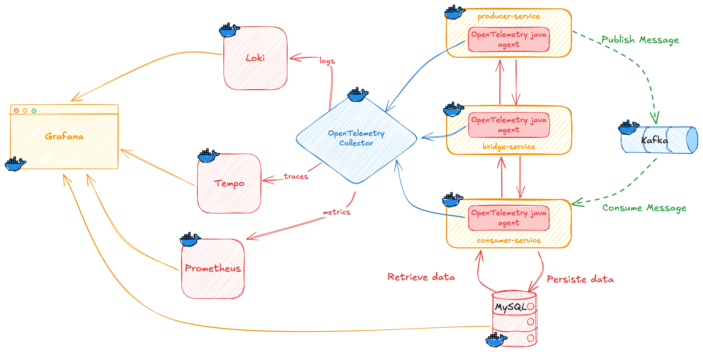
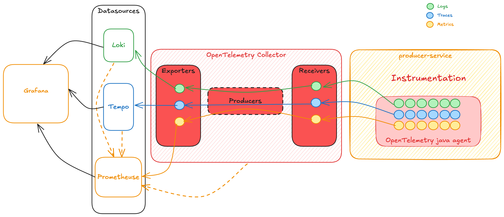
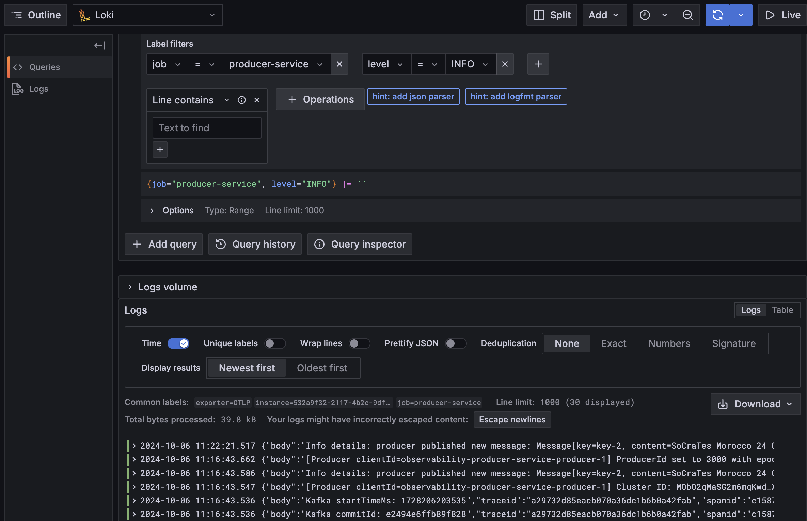
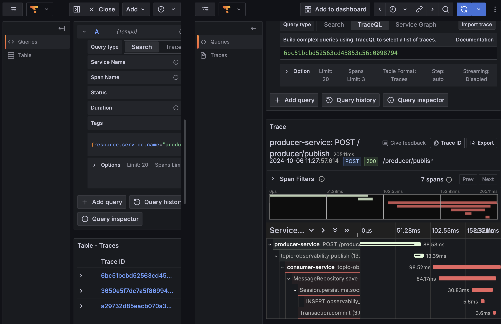
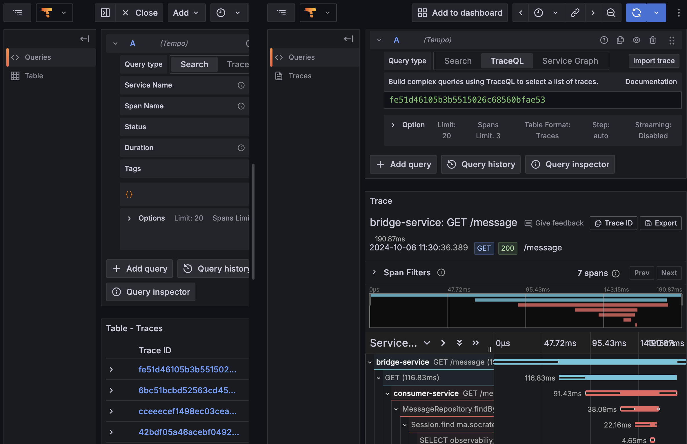
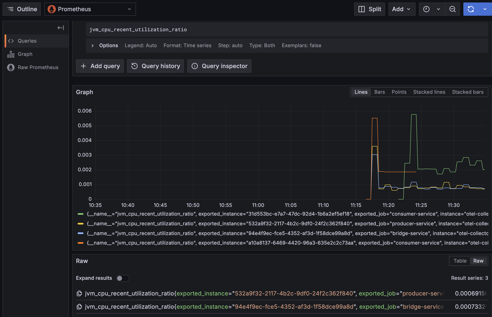

# Observability Project

This repository demonstrates the implementation of full observability for a microservices-based architecture using **OpenTelemetry**, **Grafana**, **Tempo**, **Loki**, and **Prometheus**. The project includes three services:

- **Producer Service**: Publishes messages to Kafka.
- **Bridge Service**: Acts as an intermediary between the producer and consumer services.
- **Consumer Service**: Consumes messages from Kafka and persists them in a MySQL database.

All services are instrumented with OpenTelemetry for distributed tracing, logs, and metrics collection. Docker Compose is used to orchestrate these services, along with **Kafka**, **MySQL**, and the **OpenTelemetry collector**.

## Table of Contents

- [Overview](#overview)
- [Architecture](#architecture)
- [Getting Started](#getting-started)
- [Monitoring with Grafana](#monitoring-with-grafana)
- [Contributing](#contributing)

 ## Overview

Observability is crucial for monitoring and troubleshooting distributed systems. This implementation provides end-to-end visibility of application performance and health metrics. By leveraging OpenTelemetry and Grafana, we can collect traces, logs, and metrics in a unified manner.

## Architecture



- **OpenTelemetry Java Agent**: Automatically instruments Java applications to collect telemetry data.
- **OpenTelemetry Collector**: Gathers and processes telemetry data before exporting it to different backends.
- **Grafana**: Visualizes metrics and logs through various data sources.
  - **Loki**: A log aggregation system.
  - **Tempo**: A distributed tracing system.
  - **Prometheus**: A metrics monitoring system.
- This project contains the following spring boot services:
  - [Producer Service](https://github.com/saidRaiss/observability-producer-service)
  - [Bridge Service](https://github.com/saidRaiss/observability-bridge-service)
  - [Consumer Service](https://github.com/saidRaiss/observability-consumer-service)

The following diagram shows how the collection of logs, traces and metrics works:


## Getting Started

### Prerequisites

- Java 21 or later
- Docker
- Docker Compose

### Clone the Project

To clone this repository and its submodules, run:

```bash
git clone --recursive https://github.com/your-username/observability-project.git
```

### Docker Compose

The project uses Docker Compose for easy orchestration of all services and observability tools.

```bash
docker compose up -d
```

### Accessing Observability Dashboards

- **Grafana**: [http://localhost:3000](http://localhost:3000)  
  **Default credentials**: `admin/admin`
- **Kafka-ui**: [http://localhost:8090](http://localhost:8090) 

### Warning ⚠️

MySQL DB visualization in Grafana is enabled, but it is **<span style="color:red"><u>NOT RECOMMENDED</u></span>** for production environments due to potential performance and security risks. Please use it only for local testing purposes.

## Monitoring with Grafana

Grafana provides a powerful interface to visualize logs, traces, and metrics from your observability setup. Below are examples of different types of data you can monitor:

### Grafana Explorer - Logs from Loki



This screenshot shows logs collected from Loki, where you can filter and search for specific log entries.

### Async Traces (Producer -> Kafka -> Consumer -> MySQL)



This visualization represents the asynchronous tracing flow from the producer through Kafka to the consumer, ultimately persisting data into MySQL.

### Sync Traces (Producer -> Bridge -> Consumer -> MySQL)



This screenshot displays synchronous traces where the producer communicates with the bridge service, and the bridge interacts with the consumer, with the end result being stored in MySQL.

### Metrics from Prometheus



This screenshot showcases various metrics collected by Prometheus, providing insights into the performance and health of the microservices.

### Bruno Collection

This repository includes a **Bruno collection**, which allows you to easily interact with the microservices in this observability project.

## Contributing

Contributions are welcome! If you have suggestions for improvements, new features, or bug fixes, please feel free to reach out. 

### How to Contribute

1. **Fork the Repository**: Create your own fork of the repository.
2. **Create a Branch**: Create a new branch for your feature or bug fix.
3. **Make Changes**: Implement your changes and commit them.
4. **Submit a Pull Request**: Open a pull request detailing your changes and why they are beneficial.

I would be very glad to have your suggestions and contributions to enhance this project. Together, we can improve the observability of microservices!
